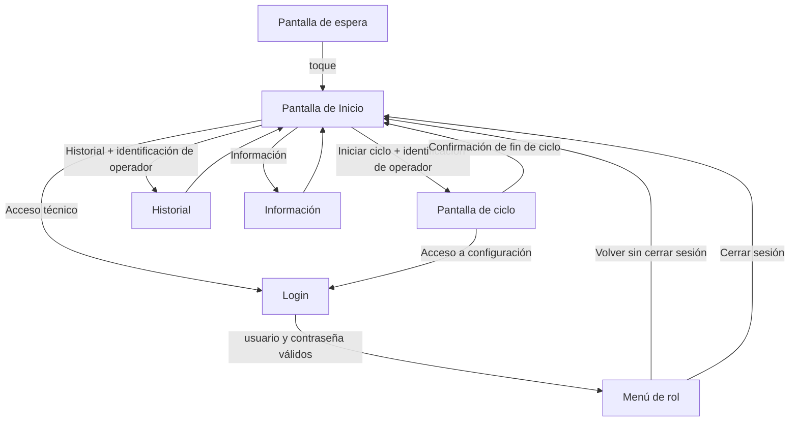

# Planeación — Pantalla de Inicio / Menú Principal (UI QML)

Proyecto: Software de autoclave — Especifika S.A.S.
Clasificación de software: IEC 62304 Clase C
Documento: `docs/mis_plans/planeacion_menu_principal.md`
Versión: 0.3
Fecha: 2026-09-24
Destinatarios: Cristian (aprobación), diseñador externo de UI (ajuste del mockup), desarrollo (construcción posterior en QML)

## Historial de cambios

- 0.1 (2026-09-24): borrador inicial con 8 decisiones pendientes.
- 0.2 (2026-09-24): se resuelven P-01 a P-08. Se define la numeración de programas, la estructura de roles y el registro de operadores. UI-08 pasa a hallazgo formal. Se corrige la contradicción entre §2 y §6.1 sobre `es.json`.
- 0.3 (2026-09-24): se corrige el §4 con el diagnóstico de Claude Code (programas y carpeta `factory/`). B-12 queda confirmado. Se agregan B-13 a B-16 y los hallazgos UI-09 y UI-10.

---

## 1. Objetivo

Definir la arquitectura de información de la pantalla de Inicio (llamada "Menú Principal" en el mockup del diseñador) a partir del flujo real de operación del autoclave. Este documento reemplaza como referencia funcional a los 8 mosaicos propuestos por el diseñador. El diseñador ajusta el mockup a este documento; la construcción en QML empieza solo después de ese ajuste.

## 2. Alcance

Incluido:

- Contenido, acciones y accesos de la pantalla de Inicio.
- Comportamiento de la pantalla según el estado de la máquina.
- Coordinación entre las pantallas de Puerta 1 y Puerta 2.
- Reglas de identificación de operador, sesión e inactividad que afectan a esta pantalla.
- Reglas de numeración de programas que se muestran en Inicio.
- Disposición final de cada uno de los 8 mosaicos del diseñador.
- Brechas entre este documento y el código actual (se registran; no se corrigen aquí).

Fuera de alcance:

- Código QML o Python.
- Diseño visual (colores, tamaños, íconos): responsabilidad del diseñador dentro de los tokens ya definidos.
- Contenido interno de los menús de rol, de la pantalla de ciclo, de Historial y de la edición de programas. Cada uno requiere su propio plan.
- Matriz de permisos por rol: plan aparte (sección 11.2).
- Cambios en backend. Las brechas de la sección 12 alimentan planes posteriores.

## 3. Terminología

- Pantalla de espera: pantalla transitoria con reloj y logo. Se toca para continuar. En disco sigue llamándose `Arranque.qml` (rename pendiente, ver B-10).
- Pantalla de Inicio (Menú Principal): pantalla de acceso libre donde el operador selecciona y envía el ciclo, ve el estado del equipo y accede a los demás menús.
- Pantalla de ciclo: pantalla que se muestra mientras la máquina está en estado CICLO (equivalente a `CycleWindow` de tkinter).
- Menú de rol: menú al que se llega tras autenticarse con usuario y contraseña. Su contenido depende del rol de usuario.
- Rol de usuario: rol de la persona autenticada (`usuarios.rol`): admin, técnico, biomédico, ingeniero (sección 11.2). Lo gestiona `SessionManager`.
- Rol de estación: rol del puesto físico definido en el perfil de instalación (`Role.OPERATOR_FRONT`, `OPERATOR_BACK`, `SERVICE`). No es un rol de usuario. Este documento no usa el rol de estación para decidir qué se muestra.
- Operador: persona que lanza ciclos o consulta el historial. Se identifica por nombre, sin contraseña, contra el registro de operadores del equipo (sección 9).
- Número de programa: identificador numérico permanente de un programa de esterilización. Es la forma en que los operadores se refieren al programa en la práctica ("la carga va en el 2"). No es el contador de ciclos ejecutados.
- Origen del programa: indica si el programa fue creado de fábrica o por un usuario. Es independiente del origen de sus parámetros.
- Origen de los parámetros: indica si los valores de un parámetro son los de fábrica o fueron modificados por un usuario. Es independiente del origen del programa.

## 4. Línea base verificada

Verificación de solo lectura hecha con Claude Code el 2026-09-24 sobre `C:\Users\tecni\Documents\codigo_autoclave\`:

- Rama local: `dev`, HEAD `f9b2073`. Un commit local sin subir a `origin/dev`.
- `dev` y `origin/main` divergen: 13 commits de `dev` no están en `main`; 31 de `main` no están en `dev` (incluye apertura automática de puerta al finalizar ciclo y audios de puerta).
- Working tree con 38 archivos modificados sin commit y 15 sin versionar.

Archivos usados como evidencia para este documento, con su estado:

- `ui/window/main_window.py` (UI tkinter en producción): tiene 85 líneas agregadas y 6 quitadas sin commit que no fueron revisadas para este documento. Las conclusiones sobre tkinter se basan en la versión commiteada.
- `backend/server.py`: cambios menores sin commit (3/4 líneas). Lista de rutas verificada contra el working tree.
- `db_manager.py`, `ser_puertas.py`: cambios menores sin commit.
- `ui_service_backend.py`, `cycle_window.py`, `permissions.py`, `installation/profile.py`, `session_manager.py`, `ui_pyside/views/home.py`, `login.py`, `secado.py`: sin cambios, iguales a `origin/main`.

Hechos del código que condicionan este documento:

- No existe endpoint de pausa de ciclo. Operaciones de ciclo disponibles: `POST /cycle/select`, `/cycle/start`, `/cycle/abort`, `/cycle/acknowledge`, `/fault/reset`.
- `POST /cycle/start` solo tiene efecto con la flag `LISTO_PARA_CICLO` activa.
- La selección de programa en tkinter se bloquea cuando el estado global es CICLO.
- La tabla `ciclos` tiene la columna `operador`, pero nunca se llena (`cycle_logger.py:184` no la pasa). El ticket imprime una línea para firma manual.
- Roles de usuario presentes en código: `operador` (default de la tabla), `admin` (usuario semilla), `tecnico` (solo en `_ROLES_PERMITIDOS` de la vista de calibración).
- `PERMISSIONS` niega `start_cycle` a `OPERATOR_BACK`, pero el asistente de instalación siempre asigna `OPERATOR_FRONT`.
- Los JSON de programas no tienen campo de número de programa ni de origen. Campos de primer nivel: `cycle_id`, `display_name`, `cycle_icon`, `cycle_temperature_sensors`, `parameters`.
- La carpeta `factory/` no contiene programas: guarda los valores por defecto de los parámetros de los programas de usuario, emparejados por nombre de archivo. En runtime, `/cycles` devuelve solo programas con `source == "user"`.
- Programas actuales: `bowe_dick`, `134_instrumental` e `instrumental_121`. Los tres son programas de fábrica según Cristian. `instrumental_121` no tiene archivo de valores por defecto en `factory/` (B-15).
- `GET /cycles` no ordena de forma explícita; el orden depende de `os.listdir`.
- No existe código que compare el valor de un parámetro de usuario contra el de fábrica.

## 5. Flujo de navegación

Reglas del flujo:

1. Inicio es de acceso libre. Nunca se muestra "con sesión": la sesión solo habilita los menús de rol.
2. El login exitoso lleva directamente al menú del rol del usuario autenticado. No regresa a Inicio.
3. Durante un ciclo, la única salida de la pantalla de ciclo es el acceso a configuración, que va directo a Login (se omite Inicio). Tras autenticarse se llega al menú de rol.
4. La pantalla de ciclo se cierra al confirmar el fin de ciclo (comportamiento actual de `CycleWindow`).

## 6. Contenido de la pantalla de Inicio

### 6.1 Bloque de ciclo

Reemplaza al mosaico "Iniciar Ciclo" del diseñador. No es un mosaico que navega: el ciclo se selecciona y se envía desde la misma pantalla.

Contenido:

- Programa seleccionado: número de programa destacado y nombre. Al tocarlo se abre la lista de programas de usuario (`/cycles` con `source == "user"`), también con número y nombre. Bloqueado cuando el estado global es CICLO.
- Parámetros del programa, solo lectura: temperatura de esterilización, tiempo de esterilización, tiempo de secado.
- Lecturas actuales: temperatura de cámara y presión de cámara.
- Botón Iniciar ciclo.

Inicio no distingue el origen del programa ni el origen de sus parámetros (sección 6.5).

Reglas:

- Seleccionar el programa no requiere sesión ni identificación.
- Iniciar ciclo no requiere sesión. Antes de enviar `POST /cycle/start`, el sistema pide el nombre del operador; el envío solo procede si el nombre coincide con un operador registrado (sección 9).
- Botón Iniciar habilitado solo con `LISTO_PARA_CICLO` activa.
- En estado FALLA, el botón Iniciar se reemplaza por Reset de falla (sección 6.2).
- Pausar y continuar ciclo quedan fuera del alcance: el backend no los soporta. Las claves `ciclo.pausar`, `ciclo.continuar` y `estados.en_pausa` ya se quitaron de `es.json` (sin commit a la fecha de esta versión). Esta versión de `es.json` difiere de la entrega del diseñador.

### 6.2 Acciones directas (sin sesión)

- Abrir y cerrar la puerta propia de la estación. El backend sigue validando la seguridad física (`_can_open_physical`).
- Reset de falla, visible solo en estado FALLA.
- Reconocer alarma.

### 6.3 Resumen del sistema

- Estado global de la máquina.
- Estado de las puertas: ambas en equipos de dos puertas; una sola en equipos de una puerta.
- Alarmas y condiciones activas: lista completa con scroll (sin el límite de 5 de tkinter).
- Suministro eléctrico.
- Estado de conexión con el controlador.
- Versión de software.
- Versión de la tarjeta de E/S (ver B-04).
- Número total de ciclos ejecutados por el equipo (ver B-05).
- Fecha del próximo mantenimiento programado (sección 6.6, ver B-03).

Temperatura y presión de cámara se muestran una sola vez en pantalla. El diseñador decide si viven en el bloque de ciclo o en el resumen; no se duplican.

### 6.4 Accesos

- Historial: acceso libre, con identificación de operador antes de entrar (sección 9). Contiene:
  - Consulta de ciclos.
  - Reimpresión del ticket de un ciclo, idéntico al impreso durante el ciclo.
  - Impresión de ciclos por rango de fechas (equivale a "Imprimir Ciclos" de `ui_pyside/views/ciclos.py`), sin envío por correo.
  - Impresión de alarmas activas (equivale a "Imprimir Alarmas" de `ui_pyside/views/impresion_menu.py`).
- Información: acceso libre.
- Acceso técnico (Login): lleva a la pantalla de Login.

### 6.5 Numeración de programas

Aplica a todo el sistema; se incluye aquí porque Inicio muestra el número.

1. Cada programa tiene un número de programa permanente.
2. Rango 1 a 10: reservado para programas creados de fábrica. Los equipos salen con un máximo de 5 programas de fábrica; el resto del rango queda libre para programas de fábrica futuros.
3. Desde 11: programas creados por usuarios, asignados en orden de creación.
4. Los números nunca se reutilizan. Si un programa se elimina, su número queda retirado.
5. El número depende del origen del programa, no del origen de sus parámetros. Un programa de fábrica con parámetros modificados conserva su número del rango 1 a 10.
6. En la pantalla de configuración de parámetros (fuera de Inicio), cada parámetro cuyo valor difiere del de fábrica se marca con un asterisco (*) al final. Detalle en el plan de edición de programas.
7. En Inicio y en la lista de selección, los programas se ordenan por número de programa.

Estado actual: ninguna de estas reglas existe en el código (B-12, B-13, B-14). Su diseño corresponde al plan de programas y numeración.

### 6.6 Próximo mantenimiento programado

La fecha se calcula por intervalo de días o por número de ciclos, lo que ocurra primero. Quién configura los intervalos se define en la matriz de permisos (sección 11.2).

## 7. Disposición de los 8 mosaicos del diseñador

1. Iniciar Ciclo: se transforma en el bloque de ciclo de la sección 6.1. Deja de ser un mosaico.
2. Historial: se mantiene. Acceso libre con identificación de operador.
3. Programas: sale de Inicio y pasa al menú de rol. Solo roles de servicio técnico lo editan; cuál exactamente lo define la matriz de permisos.
4. Reportes: se fusiona en Historial (reimpresión de ticket e impresión por rango).
5. Impresión: se fusiona en Historial (impresión por rango e impresión de alarmas).
6. Mantenimiento: sale de Inicio y pasa al menú de rol de servicio técnico, no a admin.
7. Conectividad: se elimina de V1.0 por el hallazgo H-03 (endpoints de actuadores sin autenticación).
8. Información: se mantiene.

Elemento nuevo que no está en el mockup: Acceso técnico (Login).

Resultado: Inicio queda con el bloque de ciclo, las acciones directas, el resumen del sistema y tres accesos (Historial, Información, Acceso técnico).

## 8. Comportamiento según estado

- Sin preparar (flag `LISTO_PARA_CICLO` inactiva): Iniciar deshabilitado. Las condiciones que impiden el inicio aparecen en la lista de alarmas y condiciones.
- Listo: Iniciar habilitado.
- CICLO: ambas pantallas pasan a la pantalla de ciclo (sección 10). Selección de programa bloqueada.
- FALLA: Reset de falla reemplaza a Iniciar.
- Sin conexión con el controlador: se muestra el mensaje `sistema.sin_conexion` de `es.json`. Iniciar, Reset de falla y las acciones de puerta quedan deshabilitados mientras dure la desconexión, porque el backend no puede confirmarlas.
- Modo prueba de E/S activo: se muestra el mensaje `sistema.modo_prueba`.

## 9. Identificación de operador

Aplica antes de iniciar un ciclo y antes de entrar al Historial.

1. El operador escribe su nombre. No se pide contraseña.
2. La comparación contra el registro no distingue mayúsculas, tildes ni espacios extra (al inicio, al final o repetidos entre palabras).
3. Si el nombre no coincide con un operador registrado, se muestra un mensaje y se permite reintentar. No existe forma de omitir la identificación.
4. El nombre del operador que inicia el ciclo se guarda en `ciclos.operador`.

Registro de operadores:

- Vive en una tabla propia (`operadores`), separada de `usuarios`. La tabla `usuarios` queda solo para personas que se autentican con contraseña.
- Lo administran admin y los roles de servicio técnico, desde su menú de rol. Qué roles de servicio exactamente lo define la matriz de permisos.
- El diseño de la tabla y de la pantalla de gestión es un plan aparte (B-02).

## 10. Coordinación entre puertas

- Ambas estaciones (Puerta 1 y Puerta 2) pueden iniciar y abortar el ciclo.
- Al iniciarse un ciclo desde cualquiera de las dos pantallas, ambas cambian a la pantalla de ciclo.
- Los menús son independientes por estación: navegar en una pantalla no afecta a la otra.
- La sesión es independiente por estación (un `SessionManager` por proceso de UI).
- En equipos de una sola puerta, la pantalla muestra una sola puerta y no hay coordinación.

## 11. Sesión y roles

### 11.1 Sesión

- El login se hace desde Acceso técnico en Inicio, o desde la pantalla de ciclo (acceso a configuración).
- El login exitoso lleva al menú del rol del usuario.

Cierre de sesión:

1. Manual, desde el menú de rol.
2. Por inactividad: si el usuario sale de los menús de rol a Inicio sin cerrar sesión y no vuelve a entrar a un menú de rol en 5 minutos, la sesión se cierra. Si vuelve antes de ese tiempo, no se pide contraseña.
3. Al iniciar un ciclo.

### 11.2 Roles de usuario

Nombres provisionales:

- admin: gestión de usuarios y del registro de operadores. No accede a Mantenimiento.
- técnico: servicio técnico. Nivel inferior a biomédico e ingeniero.
- biomédico: nivel ingeniero. Corresponde al servicio local (biomédico del sitio o servicio técnico local).
- ingeniero: nivel ingeniero. Corresponde al proveedor del equipo. Tiene permisos distintos a biomédico.

La matriz de permisos (qué puede hacer cada rol, incluida la edición de programas, la configuración de intervalos de mantenimiento y la gestión del registro de operadores) es un plan aparte. Este documento solo fija que Mantenimiento y Programas pertenecen a los roles de servicio técnico y que la gestión de usuarios pertenece a admin.

## 12. Brechas contra el código actual

Se registran para planes posteriores. No se corrigen en este documento.

- B-01: `PERMISSIONS` niega `start_cycle` a `OPERATOR_BACK`, lo que contradice la sección 10. Hoy no se manifiesta porque el asistente de instalación siempre asigna `OPERATOR_FRONT`.
- B-02: no existe registro de operadores. `ciclos.operador` existe pero nunca se llena.
- B-03: no existe fuente de datos ni configuración de intervalos para el próximo mantenimiento programado.
- B-04: ninguna ruta del backend expone la versión de la tarjeta de E/S.
- B-05: ninguna ruta expone el total de ciclos del equipo.
- B-06: no hay registro de quién consulta el historial.
- B-07: `SessionManager` no tiene temporizador de inactividad.
- B-08: la pantalla de ciclo actual no tiene acceso a configuración.
- B-09: los roles técnico, biomédico e ingeniero no existen como tales. `tecnico` solo aparece en la vista de calibración.
- B-10: `Arranque.qml` sigue sin renombrarse a `Espera.qml`.
- B-11: la pantalla actual de impresión por rango (`ui_pyside/views/ciclos.py`) incluye envío por correo, que es una función de red bloqueada por H-03 y no se traslada a QML.
- B-12 (confirmada): no existe número de programa ni atributo de origen del programa. Hoy "fábrica" solo significa "valores por defecto de los parámetros" (carpeta `factory/`). Faltan el campo de número, el atributo de origen y la regla de asignación de la sección 6.5.
- B-13: no existe comparación entre el valor de usuario y el de fábrica de cada parámetro. Es la base del asterisco de la sección 6.5.
- B-14: `GET /cycles` no garantiza orden. Con numeración, debe ordenar por número de programa.
- B-15: `instrumental_121` es un programa de fábrica sin archivo de valores por defecto en `factory/`. Su pantalla de parámetros muestra "Por defecto: —". Se corrige creando el archivo con valores validados (pendiente de confirmar los valores, P-12).
- B-16: `can_open_from_context` y `can_close_from_context` comparaban el nombre de puerta contra un entero, así que la puerta propia exigía el permiso `open_other_door`. Corregido en el working tree (build del 2026-09-22). Probado abriendo y cerrando la puerta propia con la estación instalada como Puerta 1 y luego como Puerta 2, por separado. Sin probar: operación simultánea en doble pantalla y comando de la puerta opuesta.

## 13. Hallazgos de seguridad relacionados

- H-03 / UI-07 (existente): endpoints de actuadores sin autenticación y backend escuchando en todas las interfaces. Justifica eliminar Conectividad y el envío por correo de V1.0.
- UI-08 (formal, severidad alta): `seed_admin_if_empty` crea el usuario `admin` con contraseña `admin1234`, y las contraseñas se guardan con SHA-256 sin sal. Afecta directamente al acceso a los menús de rol definido en este documento. Se resuelve en el plan de sesión y roles.

- UI-09 (severidad alta, pendiente de verificación): `request_open()` y `request_close()` de `ser_puertas.py` solo validan condiciones físicas. Los chequeos de permiso por estación (`can_open`, `can_open_from_context` y sus equivalentes de cierre) no se invocan en ese camino. Si nadie más los llama, los permisos de `PERMISSIONS` no se aplican en `/doors/{name}/open` ni en `/doors/{name}/close`. Afecta al interlock de puerta, base de la clasificación Clase C.
- UI-10 (severidad crítica): el repositorio de GitHub es público. Su historial contiene la base de datos del equipo (tabla `usuarios` con hashes SHA-256 sin sal y el usuario semilla de UI-08), el registro de códigos de activación (`generador.db`), el perfil de instalación con número de serie y el código fuente completo. Sacar esos archivos del índice no los retira del historial.

## 14. Decisiones pendientes

- P-09: matriz de permisos por rol (sección 11.2). Plan aparte.
- P-10: nombres definitivos de los roles técnico, biomédico e ingeniero.
- P-11: resuelta en 0.3 (B-12 confirmada).
- P-12: valores de fábrica validados para `instrumental_121` (B-15), y número de programa de `134_instrumental` e `instrumental_121` dentro del rango 1 a 10 (`bowe_dick` es el 1).
- P-13: mitigación de UI-10: cambio de visibilidad del repositorio, invalidación de los códigos de activación expuestos y purga del historial.

## 15. Cambios solicitados al diseñador

1. Reemplazar el mosaico "Iniciar Ciclo" por un bloque de ciclo con los elementos de la sección 6.1. El número de programa va destacado junto al nombre, también en la lista de selección.
2. Agregar las acciones directas de la sección 6.2: puerta propia, Reset de falla, Reconocer alarma.
3. Ajustar el resumen del sistema al contenido de la sección 6.3. La lista de alarmas debe admitir un número variable de entradas con scroll.
4. Dejar solo tres accesos: Historial, Información, Acceso técnico.
5. Eliminar Programas, Reportes, Impresión, Mantenimiento y Conectividad de Inicio.
6. Eliminar Pausar y Continuar de la pantalla de ciclo, y el estado "En pausa".
7. Diseñar el diálogo de identificación de operador (sección 9), incluido el mensaje de nombre no registrado.
8. Contemplar la variante de una sola puerta.
9. Contemplar los estados de la sección 8: Iniciar deshabilitado, FALLA, sin conexión, modo prueba.

## 16. Siguientes pasos

1. Cristian aprueba esta versión.
2. Se entrega la sección 15 al diseñador.
3. Mitigación de UI-10 y verificación de UI-09.
4. Planes posteriores: matriz de permisos y sesión (incluye UI-08), registro de operadores, programas y numeración, menús de rol, pantalla de ciclo, Historial.
5. Construcción de Inicio en QML sobre el mockup ajustado.
